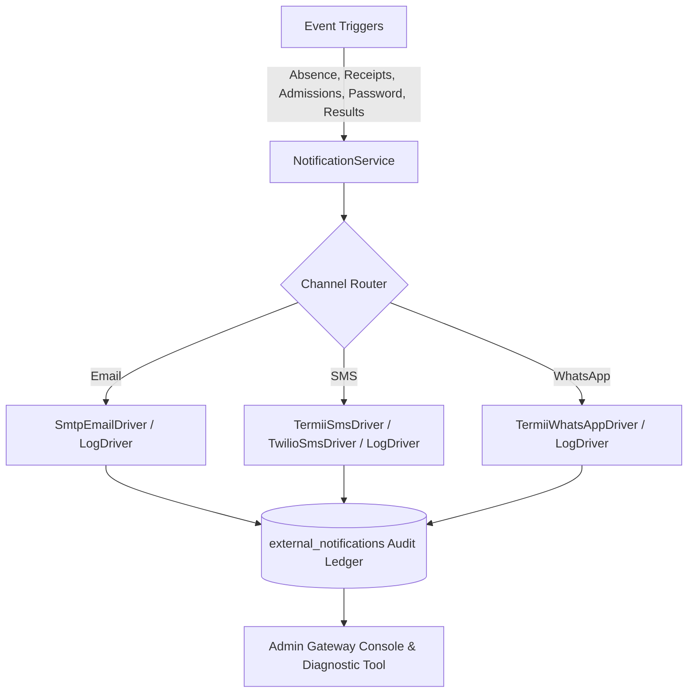

# External Notification Gateway Setup & Integration Guide
**Claret International School LMS — Phase 4 Gateway Infrastructure**

This guide provides exhaustive instructions for setting up, configuring, and maintaining the Unified Multi-Channel External Notification Gateway across **Email (SMTP/HTML)**, **SMS (Termii / Twilio)**, and **WhatsApp (Termii)**. It also contains the complete message catalog, including exact SMS text templates and HTML email layouts.

---

## 1. Architectural Overview

The notification subsystem is designed for zero-failure dispatch with resilient fallbacks, offline development safety, and a persistent delivery audit trail.



### Core Characteristics:
- **Local Dev & Offline Safety**: Defaults to the `log` driver if external credentials are unset or during offline testing. Transmissions are safely written to `storage/logs/notifications.log` without burning credits or throwing uncaught exceptions.
- **Direct Native SMTP Socket Engine**: Pure PHP stream socket implementation with TLS/SSL, `AUTH LOGIN`, and MIME multipart formatting. Eliminates external composer dependencies.
- **RESTful API Integration**: High-speed, cURL-based communication with Termii (Nigeria/West Africa) and Twilio (International/Tier-1 destinations).
- **Comprehensive Audit Trail**: Every transmission is registered with status (`queued`, `sent`, `failed`), retry counters, recipient identifiers, gateway message references, and JSON metadata in `external_notifications`.

---

## 2. Environment Configuration (`.env`)

Add and configure the following keys in your `.env` file located at the project root:

```ini
# ==============================================================================
# EXTERNAL NOTIFICATION GATEWAY (EMAIL, SMS, WHATSAPP)
# ==============================================================================

# Application Base URL (used in action buttons & portal hyperlinks)
APP_URL=https://lms.test

# ------------------------------------------------------------------------------
# 1. EMAIL (SMTP) GATEWAY CONFIGURATION
# ------------------------------------------------------------------------------
# Driver: 'smtp' for live email dispatch, 'log' for offline/dev file logging
MAIL_MAILER=smtp
MAIL_HOST=smtp.gmail.com
MAIL_PORT=587
MAIL_USERNAME=notifications@claret.edu.ng
MAIL_PASSWORD=your_app_specific_password_or_api_key
MAIL_ENCRYPTION=tls
MAIL_FROM_ADDRESS=notifications@claret.edu.ng
MAIL_FROM_NAME="Claret International School"

# ------------------------------------------------------------------------------
# 2. SMS GATEWAY CONFIGURATION
# ------------------------------------------------------------------------------
# Gateway: 'termii' for Nigeria/Africa, 'twilio' for International, 'log' for dev
SMS_GATEWAY=termii
SMS_SENDER_ID=Claret

# Termii API Credentials (https://termii.com)
TERMII_API_KEY=your_termii_api_key_here
TERMII_API_URL=https://api.ng.termii.com

# Twilio SMS Credentials (https://www.twilio.com)
TWILIO_SID=ACXXXXXXXXXXXXXXXXXXXXXXXXXXXXXXXX
TWILIO_AUTH_TOKEN=your_twilio_auth_token_here
TWILIO_FROM=+1234567890

# ------------------------------------------------------------------------------
# 3. WHATSAPP GATEWAY CONFIGURATION
# ------------------------------------------------------------------------------
# Gateway: 'termii' or 'log'
WHATSAPP_GATEWAY=termii
WHATSAPP_DEVICE_NUMBER=2348012345678
WHATSAPP_DEVICE_ID=your_termii_device_id_here
```

---

## 3. Email Gateway Setup (Step-by-Step)

### Option A: Gmail SMTP (Recommended for Quick Setup / Small Deployments)
1. Log in to the institutional Google Account (e.g., `admin@claret.edu.ng`).
2. Visit **Google Account Security** → Enable **2-Step Verification**.
3. Under Security, navigate to **App Passwords**.
4. Generate an app password for `Mail / Windows Computer`. Google will provide a 16-character password (e.g., `abcd efgh ijkl mnop`).
5. Configure `.env`:
   ```ini
   MAIL_MAILER=smtp
   MAIL_HOST=smtp.gmail.com
   MAIL_PORT=587
   MAIL_USERNAME=admin@claret.edu.ng
   MAIL_PASSWORD=abcdefghijklmnop
   MAIL_ENCRYPTION=tls
   MAIL_FROM_ADDRESS=admin@claret.edu.ng
   MAIL_FROM_NAME="Claret International School"
   ```

### Option B: Mailgun / Brevo (Sendinblue) / AWS SES (High-Volume Production)
1. Sign up on [Mailgun](https://mailgun.com) or [Brevo](https://brevo.com).
2. Verify domain DNS records (`SPF`, `DKIM`, and `CNAME` records).
3. Obtain SMTP credentials from the provider dashboard:
   - **Brevo**: `smtp-relay.brevo.com`, Port `587`, Encryption `tls`
   - **Mailgun**: `smtp.mailgun.org`, Port `587`, Encryption `tls`
   - **AWS SES**: `email-smtp.us-east-1.amazonaws.com`, Port `587`, Encryption `tls`
4. Set `MAIL_HOST`, `MAIL_PORT`, `MAIL_USERNAME`, and `MAIL_PASSWORD` accordingly in `.env`.

### Option C: cPanel / Dedicated Webmail
```ini
MAIL_MAILER=smtp
MAIL_HOST=mail.claret.edu.ng
MAIL_PORT=465
MAIL_USERNAME=info@claret.edu.ng
MAIL_PASSWORD=your_cpanel_email_password
MAIL_ENCRYPTION=ssl
MAIL_FROM_ADDRESS=info@claret.edu.ng
MAIL_FROM_NAME="Claret International School"
```

---

## 4. SMS & WhatsApp Gateway Setup (Step-by-Step)

### Setting up Termii (Nigeria & West African Telcos)
Termii provides direct routes to MTN, Airtel, Glo, and 9mobile with support for NDPR and DND (Do-Not-Disturb) management.

1. **Register Account**: Sign up at [https://termii.com](https://termii.com).
2. **Retrieve API Key**: Go to **Settings** → **API Tokens** and copy your Secret API Key.
3. **Sender ID Registration**:
   - Navigate to **Sender ID** → Click **Request Sender ID**.
   - Enter `Claret` or `ClaretSchool` (maximum 11 alphanumeric characters).
   - Upload school CAC or Ministry of Education registration certificate as proof of authorization.
   - Approval is typically granted within 2 to 4 business hours.
4. **Fund Wallet**: Top up your Termii balance using Paystack/Card or Bank Transfer.
5. Configure `.env`:
   ```ini
   SMS_GATEWAY=termii
   SMS_SENDER_ID=Claret
   TERMII_API_KEY=TLxxxxxxxxxxxxxxxxxxxxxxxxxxxxxx
   TERMII_API_URL=https://api.ng.termii.com
   ```
6. **WhatsApp Channel**:
   - To send WhatsApp notifications via Termii, activate a Device Number under **Termii WhatsApp Channels**.
   - Copy the `Device ID` and assign it to `WHATSAPP_DEVICE_ID` in `.env`.

### Setting up Twilio (International SMS)
1. Sign up at [https://twilio.com](https://twilio.com).
2. Copy your **Account SID** and **Auth Token** from the Twilio Console.
3. Purchase or assign a Twilio Phone Number capable of SMS delivery.
4. Configure `.env`:
   ```ini
   SMS_GATEWAY=twilio
   TWILIO_SID=ACXXXXXXXXXXXXXXXXXXXXXXXXXXXXXXXX
   TWILIO_AUTH_TOKEN=your_auth_token_here
   TWILIO_FROM=+1234567890
   ```

---

## 5. Complete Message & Template Catalog

All messages are styled according to Claret International School's brand identity: Claret Deep Navy (`#0f172a`), Royal Burgundy (`#7f1d1d`), Emerald Green (`#059669`), and Warm Gold accents.

---

### Message 1: Student Absence Alert (Homeroom Roll-Call)
- **Trigger**: Automatic when homeroom teacher or administrator records a student as `absent` during morning roll call.
- **Recipient**: All linked parents/guardians.

#### SMS Copy:
```text
Dear Parent, [Student Name] ([Admission Number]) was marked ABSENT today ([Date]) at Claret International School. Homeroom: [Class Name]. For inquiries, contact reception.
```

#### Email Notification:
- **Subject**: `Notice of Absence: [Student Name] ([Class Name]) — Claret International School`
- **Email Content Layout**:
  - **Header Banner**: Claret Red Alert Tag (`Student Attendance Notification`)
  - **Salutation**: `Dear Esteemed Parent / Guardian,`
  - **Notice Box**: Red accented alert box indicating that the student was not present during morning homeroom registration.
  - **Metadata Table**:
    - **Student Name**: `[Student Name]`
    - **Admission Number**: `[Admission Number]`
    - **Class / Arm**: `[Class Name]`
    - **Absence Date**: `[Date]`
    - **Teacher Note**: `[Remarks or 'Unexcused absence recorded at 08:15 AM']`
  - **Guidance**: Instructions for parent if the absence was planned (submit doctor's report or notification to the principal's office).
  - **CTA Button**: `[Log In to Parent Portal]`

---

### Message 2: School Fees Electronic Payment Receipt
- **Trigger**: Automatic when payment is completed via Paystack (online) or recorded manually at the Bursary counter (Cash, Bank Transfer, POS).
- **Recipient**: Payer / Linked Guardian.

#### SMS Copy:
```text
Payment Receipt: Received NGN [Amount] for [Student Name] (Inv #[Invoice Number], Ref: [Reference]). Bal: NGN [Balance]. Thank you for choosing Claret!
```

#### Email Notification:
- **Subject**: `Payment Receipt [Ref: [Reference]]: NGN [Amount] — Claret International School`
- **Email Content Layout**:
  - **Header Banner**: Emerald Success Tag (`Official Electronic Bursary Receipt`)
  - **Salutation**: `Dear [Payer Name],`
  - **Hero Amount Card**: Large bold font: `NGN [Amount Paid]` with green checkmark badge (`Transaction Confirmed`).
  - **Transaction Breakdown**:
    - **Reference Code**: `[Reference]`
    - **Invoice Number**: `[Invoice Number]`
    - **Student Name**: `[Student Name]`
    - **Academic Term**: `[Term Name]`
    - **Date & Time**: `[Timestamp]`
    - **Outstanding Balance**: `NGN [Balance Remaining]`
  - **CTA Button**: `[View Complete Payment History]`

---

### Message 3: Admission Approval & Credentials Dispatch
- **Trigger**: Automatic when admissions officer approves an applicant docket and executes student matriculation.
- **Recipient**: Applicant / Parent.

#### SMS Copy:
```text
Congratulations! [Student Name]'s admission to Claret International School is APPROVED. Class: [Class Name]. Adm No: [Admission Number]. Portal: https://lms.test/login (Default Pass: Claret@2026!)
```

#### Email Notification:
- **Subject**: `Admission Approved! Welcome to Claret International School — [Student Name] ([Admission Number])`
- **Email Content Layout**:
  - **Header Banner**: Claret Royal Navy & Gold Crest Header
  - **Salutation**: `Dear [Parent Name],`
  - **Formal Acceptance Body**: Official notification confirming successful evaluation and matriculation of the prospective ward.
  - **Matriculation Dossier Card**:
    - **Student Name**: `[Student Name]`
    - **Admission Number**: `[Admission Number]`
    - **Class Arm Assigned**: `[Class Name (with arm)]`
    - **Portal URL**: `https://lms.test/login`
    - **Assigned Student Email**: `[student_adm]@student.claret.edu.ng`
    - **Temporary Password**: `Claret@2026!` (Highlighted in security box with instructions to change upon first login)
  - **Next Steps**: Orientation schedule and uniform pickup guidelines.
  - **CTA Button**: `[Access Claret LMS Portal]`

---

### Message 4: Secure Password Recovery
- **Trigger**: Automatic when a user (student, parent, teacher, admin) requests a password reset link.
- **Recipient**: Registered user email.

#### Email Notification:
- **Subject**: `Password Reset Instructions — Claret International School Portal`
- **Email Content Layout**:
  - **Header Banner**: Security Key Icon with `Claret Authentication Security`
  - **Salutation**: `Hello [Name],`
  - **Message**: Notification that a password reset was requested for their portal account.
  - **Validity Warning**: Reset token is cryptographically secure and expires in **60 minutes**.
  - **CTA Button**: `[Reset My Password]` (`https://lms.test/reset-password?token=[Token]&email=[Email]`)
  - **Security Footnote**: Notice that if the user did not request this change, they can safely disregard the email.

---

### Message 5: Terminal Report Card Release Announcement
- **Trigger**: Automatic when administrator publishes terminal examination results for a class or the entire school.
- **Recipient**: Parents and guardians of enrolled students.

#### SMS Copy:
```text
Claret Results Alert: Terminal report cards for [Class Name] ([Term Name]) have been published. Check report card at: https://lms.test/parent/dashboard
```

#### Email Notification:
- **Subject**: `Official Terminal Results Released: [Class Name] ([Term Name]) — Claret International School`
- **Email Content Layout**:
  - **Header Banner**: Claret Academic Excellence Badge
  - **Salutation**: `Dear Parent / Guardian,`
  - **Announcement**: Formal declaration of terminal results release following academic committee ratification.
  - **Session Dossier**:
    - **Class / Section**: `[Class Name]`
    - **Academic Session**: `[Session Name]`
    - **Term**: `[Term Name]`
  - **Scratch Card / PIN Information**: Guidelines on entering the Result Access Scratch-Card PIN or purchasing one directly from the portal.
  - **CTA Button**: `[View Terminal Report Card]`

---

### Message 6: General Broadcast & Institutional Bulletin
- **Trigger**: Dispatched manually from the Admin Notification Gateway Broadcast Console.
- **Recipient**: Custom cohort (All Parents, All Teachers, All Students, or Custom Recipient).

#### Email Notification:
- **Subject**: `[Custom Broadcast Title] — Claret International School`
- **Email Content Layout**:
  - **Header Banner**: Official School Bulletin Banner
  - **Body Content**: Formatted institutional announcement.
  - **Action Button**: `[Visit Portal]`

---

## 6. Admin Control Center & Diagnostic Test Console

Administrators can monitor gateway operational status, send live test transmissions, and review delivery logs directly from the portal.

### Gateway Navigation:
1. Log in with an `admin` or `super_admin` account.
2. In the sidebar navigation under **Communications**, click **Notification Gateway** (`/admin/notifications/gateway`).

### Control Center Features:
1. **Real-time Status Indicators**:
   - **Email (SMTP)**: Shows configured driver, SMTP host, and port.
   - **SMS**: Shows configured gateway (`termii` / `twilio` / `log`) and Sender ID.
   - **WhatsApp**: Shows channel provider and active device ID.
   - **Total Dispatches & Success Rate**: Dynamic telemetry counter.
2. **Live Diagnostic Test Console**:
   - Select channel (`Email`, `SMS`, or `WhatsApp`).
   - Enter destination recipient address or phone number.
   - Enter test message text and click **Send Test Transmission**.
   - Instant response feedback is rendered with message IDs and status codes.
3. **Cohort Broadcast Console**:
   - Select Target Cohort (`All Parents`, `All Teachers`, `All Students`).
   - Select delivery channels (`Email` and/or `SMS`).
   - Enter title and bulletin body to broadcast immediately.
4. **Audit Trail & Delivery Logs (`/admin/notifications/logs`)**:
   - Filter by Channel (`Email`, `SMS`, `WhatsApp`), Event Type, or Status (`sent`, `failed`, `queued`).
   - Search by recipient phone, email, or message keyword.
   - Inspect raw error messages, timestamps, and gateway reference IDs for failed deliveries.
